# Open Fabric Studio — User Guide

**Version 1.0.1 | Pro AV Edition**

---

## Table of Contents

1. [Introduction](#1-introduction)
2. [Logging In](#2-logging-in)
3. [Application Layout](#3-application-layout)
4. [Network Devices](#4-network-devices)
5. [Topology](#5-topology)
6. [Network Intent](#6-network-intent)
   - 6.1 [VLANs](#61-vlans)
   - 6.2 [SVIs](#62-svis)
   - 6.3 [Loopbacks](#63-loopbacks)
   - 6.4 [IGMP](#64-igmp)
   - 6.5 [PTP](#65-ptp)
   - 6.6 [Inter-Switch Links (ISLs)](#66-inter-switch-links-isls)
   - 6.7 [QoS / DSCP](#67-qos--dscp)
   - 6.8 [DHCP](#68-dhcp)
   - 6.9 [Staging and Deploying Changes](#69-staging-and-deploying-changes)
7. [Edge Devices](#7-edge-devices)
8. [Multi-Network Fabrics](#8-multi-network-fabrics)
9. [Settings](#9-settings)
   - 9.1 [Features](#91-features)
   - 9.2 [Administration](#92-administration)
   - 9.3 [Device Connection Settings](#93-device-connection-settings)
   - 9.4 [Edge Device Settings](#94-edge-device-settings)
   - 9.5 [Debug Tools](#95-debug-tools)
10. [User Roles and Permissions](#10-user-roles-and-permissions)
11. [Audit Log](#11-audit-log)

---

## 1. Introduction

Open Fabric Studio (OFS) is a web-based network management platform built for professional AV environments. It gives AV technicians, systems designers, and audio/lighting engineers a visual, AV-native interface to plan, deploy, and monitor network configurations across Cisco Catalyst 9000-series switches — without needing deep IT networking expertise.

### Key capabilities

- **Visual topology** — See your fabric in real time as a live, interactive diagram.
- **Intent-based configuration** — Define the desired state first, then stage, review, and deploy — no accidental changes.
- **Automated health checks** — Continuous monitoring flags VLAN inconsistencies, missing IGMP queriers, PTP clock issues, and more before they impact a show.
- **Full audit trail** — Every action is logged with timestamp, user, category, and severity.

### Supported hardware

- Cisco Catalyst 9200, 9300, 9400, 9500 series
- Cisco Nexus 9300 (experimental)

---

## 2. Logging In

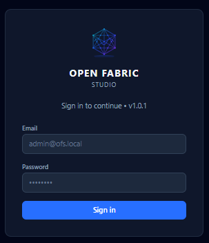

Open your browser and navigate to the Open Fabric Studio URL provided by your administrator (for example, `http://192.168.1.10`).

Enter your **email address** and **password**, then click **Sign In**.

If your credentials are incorrect, an inline error message will appear. Contact your administrator if you need a password reset or a new account.

> **Roles:** What you can see and do after login depends on your assigned role. See [User Roles and Permissions](#10-user-roles-and-permissions) for details.

---

## 3. Application Layout

After logging in, every page shares a common shell:

| Area | Purpose |
|---|---|
| **Left sidebar** | Primary navigation between pages |
| **Top bar** | Current page title, discovery controls, connection state, and sign-out |
| **Main content area** | The selected workflow |
| **Sidebar footer** | Quick links to Audit Log and Settings |

---

## 4. Network Devices


The **Network Devices** page is your switch registry. All switches that OFS should manage must be registered here before discovery or deployment can run.

The page is split into two panels:
- **Left panel** — The full list of registered devices with status indicators.
- **Right panel** — Detailed information for the currently selected device.

### Adding a device


1. Click **Add Device** in the top-right corner.
2. Fill in the device details:
   - **Name** — A human-readable label (e.g., `FOH-Core-SW1`).
   - **Management IP** — The switch's management IP address.
   - **Username / Password** — NETCONF/SSH credentials for the switch.
   - **Device type** — Select the platform (e.g., Catalyst 9300).
3. Click **Save**. OFS will attempt to connect and confirm reachability.

### Editing or removing a device

Select a device from the left panel, then use the **Edit** or **Delete** controls in the detail panel. Deleting a device removes it from the registry but does not change any configuration on the switch.

### Status indicators

| Indicator | Meaning |
|---|---|
| Green | Device is reachable and connected |
| Yellow | Device is reachable but has warnings |
| Red | Device is unreachable or has a connection error |
| Grey | Device has never been contacted |

---

## 5. Topology


The **Topology** page is the primary operational view of your live network. After devices have been added and discovery has run, it displays an interactive graph of how your switches are interconnected.

### Running discovery

Click the **Discover** button in the top bar to start a discovery scan. OFS uses CDP and LLDP to walk the fabric, identify switches, map port connections, and detect edge devices. A progress indicator appears while discovery is running.

> Discovery can be run on demand or configured to run automatically on a polling interval — see [Settings → Features](#91-features).

### Using the canvas

- **Pan** — Click and drag on an empty area.
- **Zoom** — Scroll the mouse wheel.
- **Select a node** — Click on a switch to open its details in the right panel.
- **Move a node** — Drag a switch to reposition it on the canvas. Positions are saved automatically.

### Device detail panel

When a switch is selected, the right panel shows:
- Hostname, model, management IP, and software version.
- Connection status and last-seen timestamp.
- Port list with VLAN, PoE, and neighbor information.
- Active health check alerts for that device.

---

## 6. Network Intent

The **Network Intent** page is the change management workspace for global fabric configuration. It is organised into tabs, each covering a different configuration area. Changes are never pushed to devices immediately — they are first **staged**, then **reviewed**, then **deployed**.

### The intent workflow

```
Define → Stage → Review → Deploy → Commit
```

1. **Define** — Fill in the desired configuration on any intent tab.
2. **Stage** — Click **Stage Changes** to queue them for deployment.
3. **Review** — Inspect the list of staged changes and the devices they will affect.
4. **Deploy** — Click **Deploy** to push the staged changes to switches via NETCONF.
5. **Commit** — Confirm the changes are correct. Uncommitted changes can be rolled back.

---

### 6.1 VLANs

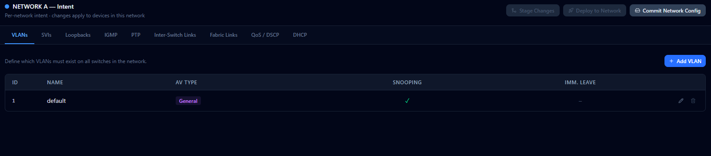

The **VLANs** tab defines every VLAN that should exist across the fabric.

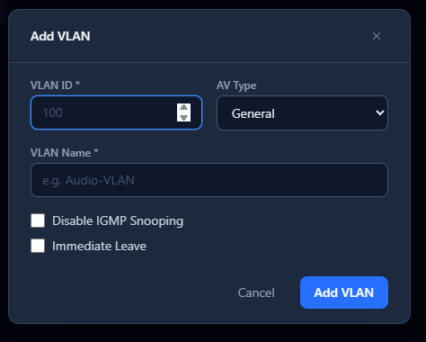

**To add a VLAN:**

1. Click **Add VLAN**.
2. Set the **VLAN ID** (1–4094).
3. Give it a descriptive **Name** (e.g., `ArtNet-Universe1`, `sACN-Production`).
4. Select the **AV type** if applicable (Art-Net, sACN, Dante, etc.) — this drives IGMP defaults.
5. Configure **IGMP snooping** as needed for multicast protocols.
6. Click **Save**.

All VLANs defined here will be created on every switch in the fabric during deployment.

---

### 6.2 SVIs

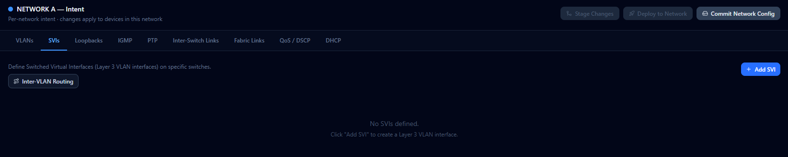

Switched Virtual Interfaces (SVIs) are Layer 3 gateway interfaces. Define an SVI for any VLAN that requires routing or a default gateway for connected devices.

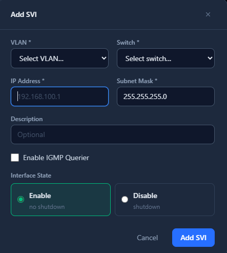

**To add an SVI:**

1. Click **Add SVI**.
2. Select the **VLAN** the SVI will serve.
3. Enter the **IP address and prefix length** (e.g., `192.168.10.1/24`).
4. Enable **HSRP** or secondary addressing if required for redundancy.

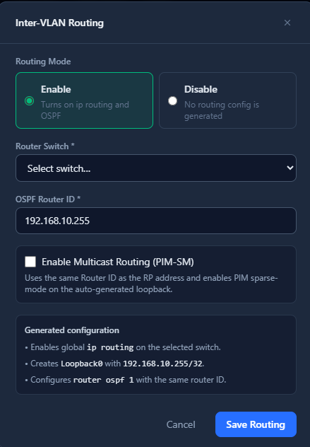

Enable **IP routing** on the SVI tab to activate inter-VLAN routing across the fabric.

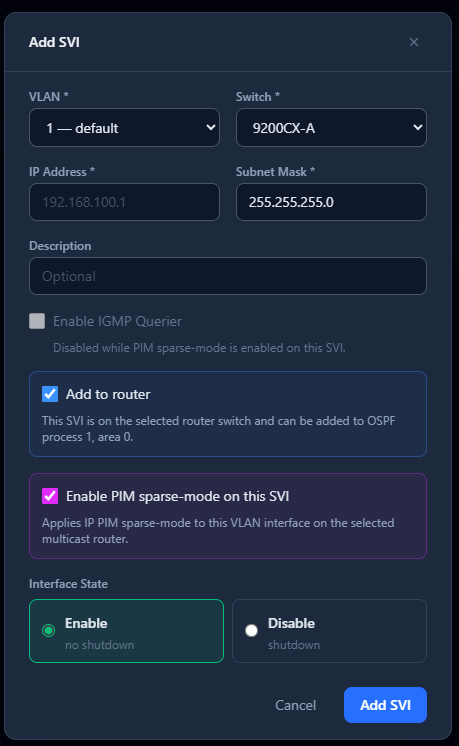

Additional SVIs can be added to the same routing domain to allow multicast and unicast traffic to move between AV VLANs.

---

### 6.3 Loopbacks

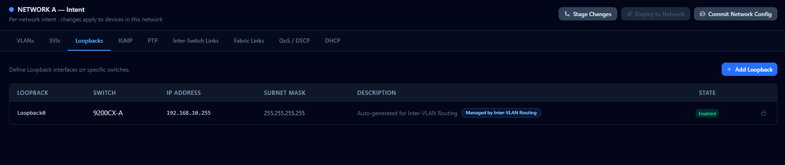

Loopback interfaces provide stable, always-up router identities. They are commonly used as PTP clock sources, OSPF router IDs, and management anchors.

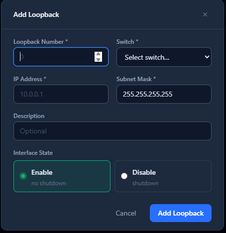

**To add a loopback:**

1. Click **Add Loopback**.
2. Select the **device** that will host the loopback.
3. Set the **Loopback number** and **IP address**.
4. Click **Save**.

---

### 6.4 IGMP

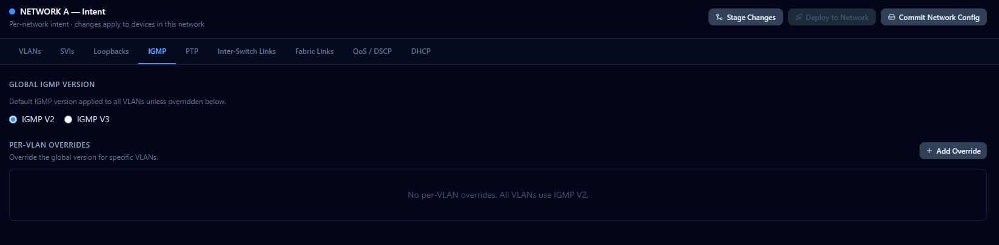

The **IGMP** tab controls multicast group management across the fabric — essential for AV protocols like Art-Net, sACN, and Dante.

**Global settings:**
- **IGMP version** — Set globally to v2 or v3 (v3 is recommended for modern AV equipment).
- **IGMP querier** — Designate which switch(es) should act as the IGMP querier on each VLAN.

**Per-VLAN overrides:**
Select a VLAN from the list to override the global settings for that specific VLAN. This is useful when a particular universe or stream network has different multicast requirements.

> **Tip:** Every multicast VLAN should have exactly one IGMP querier. The health check engine will warn you if a VLAN has zero or more than one querier.

---

### 6.5 PTP

PTP (Precision Time Protocol) synchronises clocks across your AV network — required for Dante, AVB/Milan, AES67, and other time-sensitive protocols.

**Best-practice mode:**

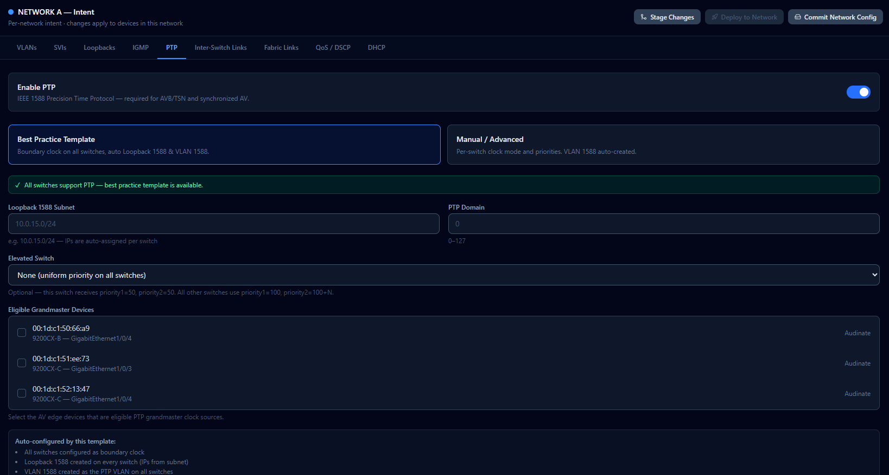

Select **Best Practice** to let OFS automatically configure PTP roles across the fabric. OFS designates the appropriate switch as the boundary clock grandmaster and configures all other switches as transparent clocks, following AV industry recommendations.

**Manual mode:**

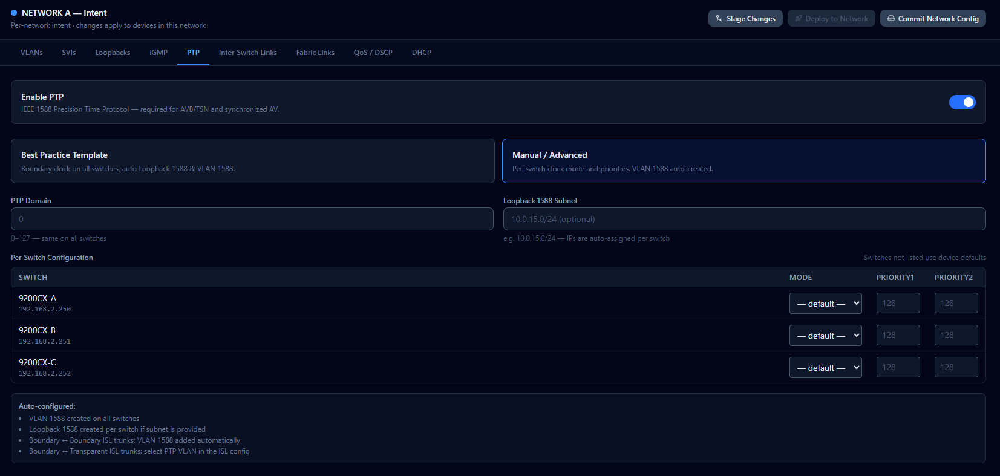

Select **Manual** to assign PTP roles device by device. Use this mode when you have a specific grandmaster already established (e.g., a dedicated GPS-locked clock) or when integrating with an existing PTP domain.

| PTP mode | When to use |
|---|---|
| Boundary Clock | Core switch acting as the fabric grandmaster |
| Transparent Clock | Downstream switches passing through PTP traffic |

---

### 6.6 Inter-Switch Links (ISLs)

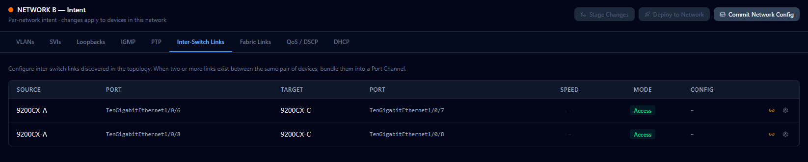

The **ISLs** tab defines trunk links between switches and configures which VLANs are allowed on each trunk.


**To edit an ISL:**

1. Select the ISL from the list.
2. Adjust the **allowed VLAN list** — add or remove VLANs as needed.
3. Set the **native VLAN** if required.
4. Click **Save**.

**Port channels:**

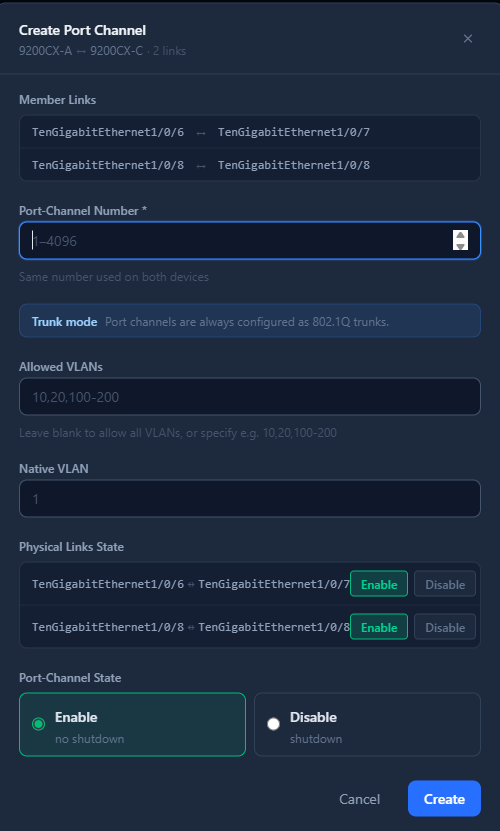

Multiple physical links between the same pair of switches can be bundled into a **Port Channel** (LACP). Select the member interfaces and set the Port Channel number. OFS will deploy the channel-group configuration to both ends simultaneously.

---

### 6.7 QoS / DSCP

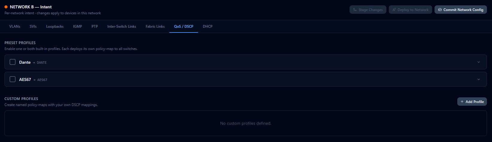

The **QoS** tab configures Differentiated Services Code Point (DSCP) markings and trust settings to prioritise AV traffic across the fabric.

**DSCP trust:**
Set interfaces to trust incoming DSCP markings from connected AV devices (recommended for professional endpoints that mark their own traffic).

**Class maps:**
Define traffic classes by DSCP value and assign them queue priorities. Common AV DSCP values:

| Traffic type | Typical DSCP |
|---|---|
| Dante / AES67 audio | EF (46) |
| AVB / Milan audio | CS7 (56) |
| sACN / Art-Net lighting | CS3 (24) |
| PTP | CS6 (48) |
| Management | CS2 (16) |

---

### 6.8 DHCP

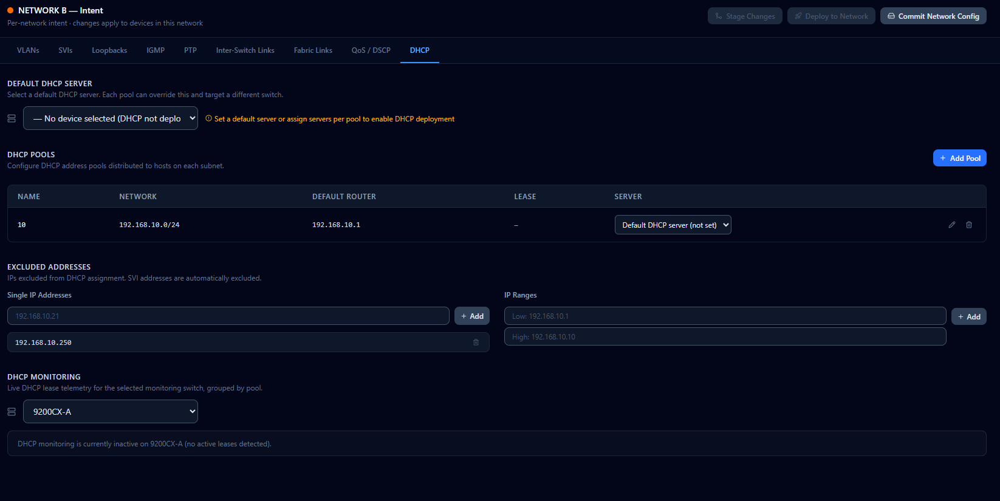

The **DHCP** tab configures DHCP server pools on the fabric switches — useful when a dedicated DHCP server is not available and the network switch should serve addresses directly.

**To add a DHCP pool:**

1. Select the **VLAN / SVI** the pool will serve.
2. Set the **pool range** (start and end IP, or prefix).
3. Add **exclusions** for statically addressed devices (switch SVIs, servers, controllers).
4. Set the **default gateway** (typically the SVI IP for that VLAN).
5. Set the **DNS server** addresses if required.
6. Click **Save**.

OFS monitors DHCP pool utilisation and raises a warning when a pool is approaching exhaustion.

---

### 6.9 Staging and Deploying Changes

After defining or editing any intent, use the controls at the top of the Network Intent page to move changes through the workflow:

| Button | Action |
|---|---|
| **Stage Changes** | Queues all unsaved intent edits for review |
| **View Staged** | Shows a diff of what will change and which devices are affected |
| **Remove Staged** | Clears the queue without deploying |
| **Deploy** | Sends staged changes to all affected switches via NETCONF |
| **Commit** | Locks in the deployed configuration; prevents automatic rollback |

> **Important:** Always review staged changes before deploying, especially in a live production environment. The affected-device list tells you exactly which switches will be touched.

---

## 7. Edge Devices

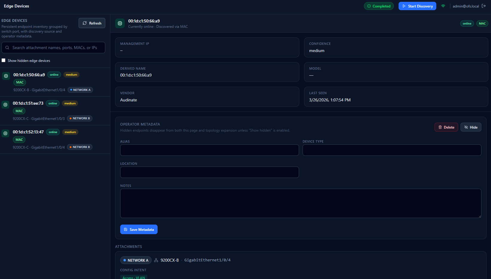

The **Edge Devices** page is the endpoint inventory — a record of every device connected to switch access ports.

OFS populates this list automatically during discovery, using LLDP neighbour data, MAC address tables, and ARP records. You can enrich each record with operator-supplied metadata.

### What you can do

- **Search** — Filter endpoints by name, MAC, IP, or port.
- **Show / hide hidden devices** — Toggle visibility for devices marked as hidden.
- **Refresh** — Re-query switch MAC and ARP tables for the latest state.
- **Link edge devices** — Manually link multiple discovered records that represent the same physical endpoint.
- **Edit a device** — Set a human-readable alias, device type, physical location, and notes.
- **Hide / delete** — Remove clutter from the inventory.

### Linking edge devices

In some environments, the same endpoint may appear more than once (for example, after moving between ports, dual-homed devices, or delayed ARP/LLDP aging). Use **Link Devices** to merge those records into a single logical endpoint.

To link records:

1. Open **Edge Devices** and select the primary endpoint record you want to keep.
2. Click **Link Devices**.
3. Select one or more matching records (typically same hostname, MAC family, or expected location).
4. Review the preview and confirm.

After linking:

- The selected devices are grouped under one logical edge device.
- Historical observations (IP, MAC, switch/port sightings) are retained for audit visibility.
- Search and filters show the linked endpoint as one device, reducing duplicate inventory rows.

To undo this action, open the linked endpoint and choose **Unlink** for the member you want to separate.

### Confidence indicators

Each discovered edge device carries a confidence badge:

| Badge | Meaning |
|---|---|
| High | Confirmed by multiple data sources (LLDP + ARP + MAC) |
| Medium | Confirmed by two data sources |
| Low | Seen only in one data source (MAC table only) |

---

## 8. Multi-Network Fabrics

OFS supports environments with more than one independent network fabric (for example, a separate lighting network and a separate audio network in the same venue).

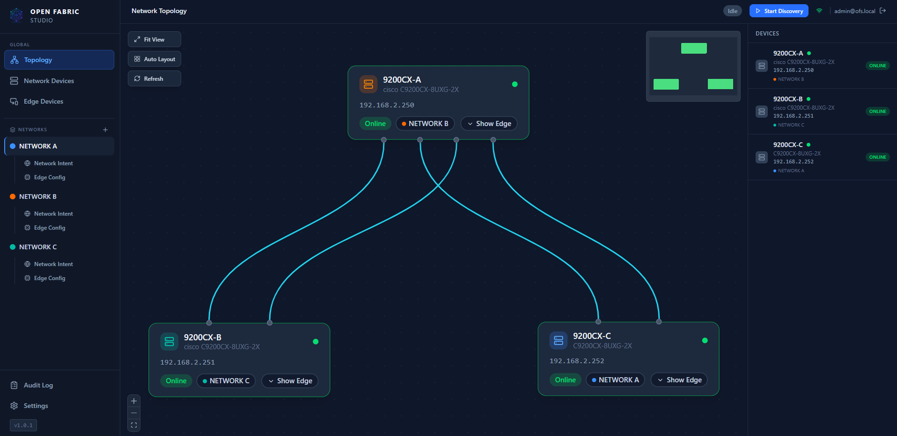

Each fabric is treated as an independent scope with its own device registry, intent, and topology. Switch between fabrics using the network selector in the top bar.

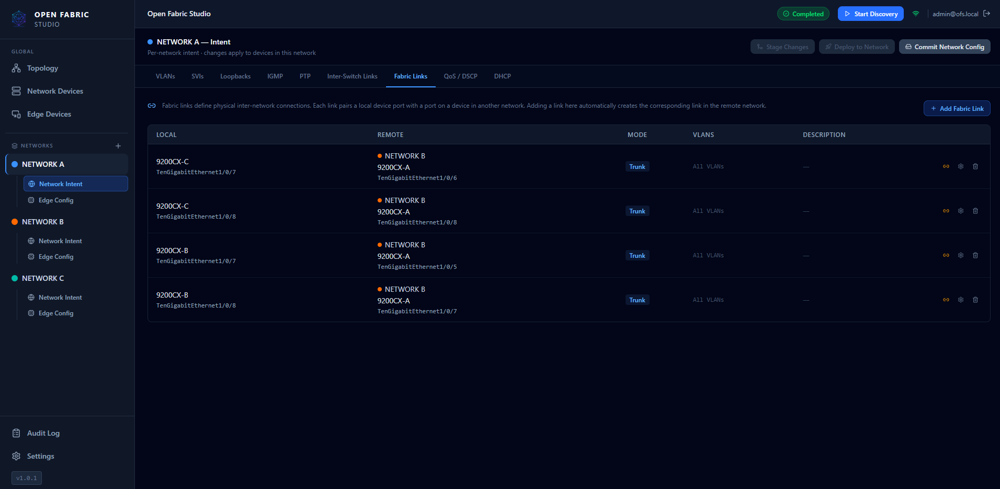

**Fabric links** are the physical connections that bridge or interconnect two fabrics (for example, a shared management VLAN or a border gateway). OFS displays these cross-fabric links distinctively in the topology to make inter-fabric dependencies clear.

---

## 9. Settings

The **Settings** page is the administrative workspace for platform behaviour, user management, and system configuration. It is divided into tabs.

---

### 9.1 Features

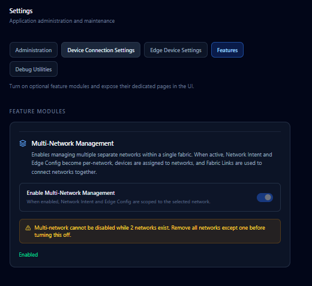

The **Features** tab controls global platform behaviour:

| Setting | Description |
|---|---|
| **Polling interval** | How often OFS automatically re-discovers and polls device state (in minutes). Set to 0 to disable auto-polling. |
| **Debug mode** | Enables verbose logging and unlocks the Debug Device Inventory page. Only enable when troubleshooting. |
| **OUI vendor mappings** | Custom MAC-address prefix-to-vendor name mappings used when identifying edge devices. |

---

### 9.2 Administration

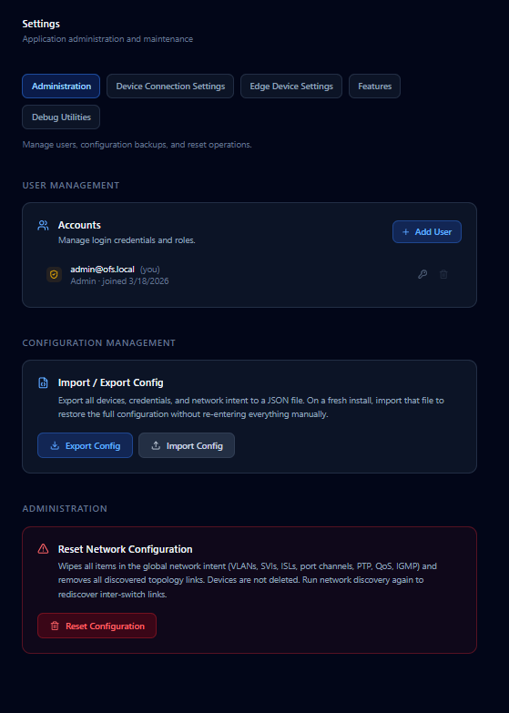

The **Administration** tab is available to **Admin** users only. It covers:

- **User management** — Create, edit, and delete user accounts. Assign roles (Viewer, Operator, Engineer, Admin).
- **Password reset** — Force a password reset for any user.
- **Configuration export** — Download a complete JSON bundle of the current OFS configuration (devices, intent, settings) for backup or migration.
- **Configuration import** — Upload a previously exported bundle to restore or clone an environment.
- **Deployment settings** — Configure NETCONF commit behaviour, rollback timers, and change windows.

---

### 9.3 Device Connection Settings


The **Device Connection Settings** tab sets default credentials and connection parameters used when OFS connects to switches:

| Field | Description |
|---|---|
| **Default NETCONF username** | SSH username used for all NETCONF sessions unless overridden per device |
| **Default NETCONF password** | SSH password (stored AES-256 encrypted) |
| **NETCONF port** | TCP port for NETCONF over SSH (default: 830) |
| **SSH timeout** | Connection timeout in seconds |

Per-device credentials set on the Network Devices page always take priority over these defaults.

---

### 9.4 Edge Device Settings


The **Edge Device** tab controls how OFS discovers and categorises endpoint devices:

- **Discovery sources** — Enable or disable LLDP, MAC table polling, and ARP-backed discovery independently.
- **Auto-hide patterns** — Define hostname or MAC patterns for devices that should be hidden from the inventory by default (e.g., printer or VOIP prefixes irrelevant to AV workflows).
- **Device type defaults** — Map OUI prefixes to device types so newly discovered endpoints are pre-classified (e.g., all Audinate MACs → "Dante Device").

---

### 9.5 Debug Tools

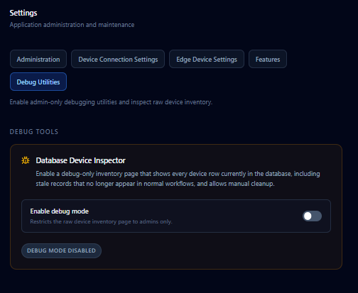

The **Debug** tab is only visible when debug mode is enabled in Features. It provides:

- **Debug Device Inventory** — A raw view of the database device table, including stale records, orphaned entries, and internal counters. Use this to clean up residual data after testing or after removing switches from the fabric.
- **Verbose log download** — Export backend logs for submission to support.

> This tab is intended for administrators and support engineers. Do not enable debug mode in a production environment unless actively investigating an issue.

---

## 10. User Roles and Permissions

| Role | Capabilities |
|---|---|
| **Viewer** | Read-only access to Topology, Health Checks, and Audit Log |
| **Admin** | Full access including user management, system settings, and debug tools |

Roles are assigned by an Admin user on the **Settings → Administration** tab.

---

## 11. Audit Log

The **Audit Log** records every significant action taken in OFS — both user-initiated and system-generated.

### Filtering

Use the filter controls at the top of the page to narrow the log:

- **Category** — Filter by event type: Discovery, Configuration, Deployment, Health Check, User Action, System.
- **Severity** — Filter by level: Info, Warning, Error, Critical.

Clear both filters to return to the full event stream.

### Common use cases

| Scenario | What to look for |
|---|---|
| Confirming a deployment ran | Category: Deployment, Severity: Info |
| Investigating a missed discovery | Category: Discovery, Severity: Warning or Error |
| Reviewing who changed a VLAN | Category: Configuration + User Action |
| Post-incident review | Sort by timestamp, filter Severity: Error or Critical |

The audit log is append-only and cannot be edited or deleted by any user.

---

*Open Fabric Studio v0.10.2 — Pro AV Edition*
